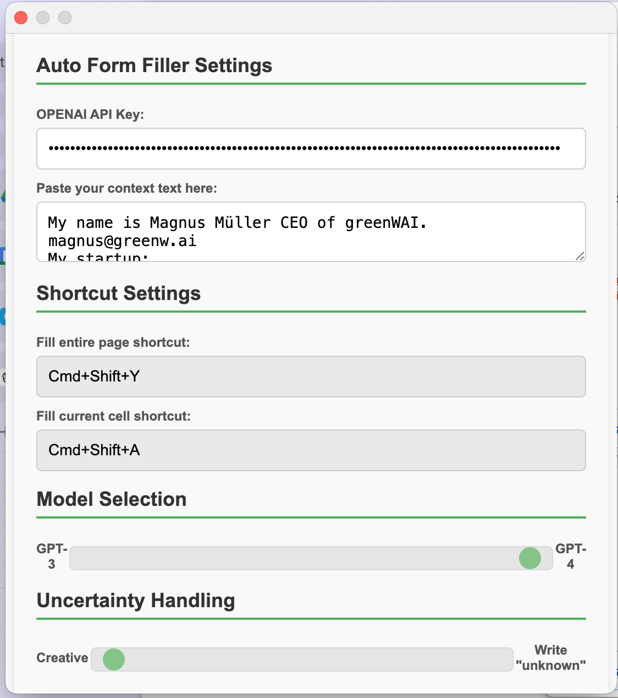

# Auto Form Filler

**Annoyed filling forms?** Use this tool to quickly fill out text in forms based on your context. Whether you need to fill out one field or complete an entire form at once, this Chrome extension is designed to save you time.

## 🚀 Features

- **Automatically fill entire forms** 
- **Specify Context once and use it for all your form filling tasks**
- **Uncertainty Handling** 
- **Fast and Easy**


## 🎥 Demo

Check out this quick tutorial video to see Auto Form Filler in action:

<video width="100%" controls>
  <source src="src/images/Tutorial.mp4" type="video/mp4">
  Your browser does not support the video tag.
</video>


## 🛠 Installation

1. Clone or download this repository.
```
git clone https://github.com/greenwai/auto-form-filler.git
```
2. Open Chrome and navigate to `chrome://extensions/`.
3. Enable "Developer mode" at the top right corner.
4. Click "Load unpacked" and select the directory where you downloaded the extension.

## 📋 Getting Started

1. Select the "Auto Form Filler" under extensions.
2. Enter your OpenAI API key.
3. Provide context about you which the model should know to fill your forms.
4. Click on the button "Save & Close" to save your context.



## 💻 Usage

1. **Step by Step:** Use the `Cmd/Ctrl + Shift + A` shortcut to fill out the current field.
2. **All at Once:** Use the `Cmd/Ctrl + Shift + Y` shortcut to automatically fill out the entire form.

## 🙌 Contributions

Contributions are welcome! Whether it's a bug report, feature suggestion, or pull request, feel free to get involved.

### Ideas and Enhancements

- [ ] Let users select custom shortcuts.
- [ ] Handle multiple different contexts.
- [ ] Include user answers in the context to improve accuracy over time.
- [ ] Use different models e.g. gemini, claude, etc.
- [ ] Improve robustness for various types of forms.
- [ ] Autofill PDF forms.

---

Enjoy using **Auto Form Filler** and save time on repetitive form-filling tasks!

This project is licensed under the terms of the MIT license.


## ⚠️ Important Note

Please be aware that the context you provide is sent to OpenAI for processing. While we strive for accuracy, the AI-generated output may not always be correct. It is crucial that you carefully review before submitting any forms. Always double-check the output to ensure its accuracy and appropriateness for your specific needs.


